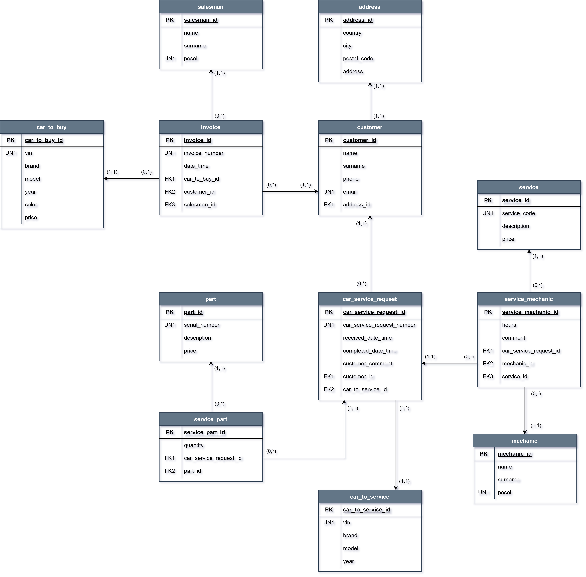

# Car Dealership Application

## Overview
A comprehensive car dealership management system built using Spring Boot technology, handling vehicle sales, service orders and mechanic operations. The CEPiK API is only used to randomly generate vehicles for educational purposes as part of learning to work with the API and offers an intuitive user interface for both customers and staff.

## ERD Diagram


## Features

### Sales Management
- Vehicle inventory tracking
- Customer management (new and existing customers)
- Purchase processing
- Salesman portal for handling transactions

### Service Management
- Service request handling
- Mechanic work assignment
- Service history tracking
- Parts inventory management

### Vehicle Information
- Integration with CEPiK (Centralna Ewidencja Pojazdów i Kierowców) API
- Detailed vehicle specifications
- Vehicle history tracking


## Technical Stack

### Backend
- Java 17
- Spring Boot 3.0.0
- Spring Security
- Spring Data JPA
- Spring WebFlux
- PostgreSQL Database
- Flyway for database migrations

### Frontend
- Thymeleaf templating engine
- Bootstrap 5 for styling


### Testing
- JUnit Jupiter
- TestContainers
- WireMock
- Rest Assured

### API Documentation
- OpenAPI/Swagger
- SpringDoc OpenAPI UI

## Installation

### Prerequisites
- JDK 17 or higher
- PostgreSQL 
- Gradle

### Setup
1. Clone the repository:
```bash
git clone https://github.com/radson29/car-dealership.git
```
2. Configure database in application.yml:
```bash
spring:
  datasource:
    url: jdbc:postgresql://localhost:5432/car_dealership
    username: your_username
    password: your_password
```
3. Build the project:
```bash
./gradlew build
```
4. Run the application:
```bash
./gradlew bootRun
```
The application will be available at http://localhost:8190/car-dealership

## API Integration
### CEPiK API
The application integrates with the **CEPiK API (v1.1.3)** for accessing vehicle information. Features include:
- Vehicle data from the CEPiK database
- Driving license information
- Vehicle statistics
- File management capabilities

### API Client Configuration
- **Generator:** Java  
- **Library:** WebClient  
- **Serialization:** Jackson  
- **Date Library:** Java 8  

## Features in Detail
### Car Purchase Flow
- Support for new and existing customers
- Vehicle selection interface
- Salesman assignment
- Purchase confirmation with invoice generation

### Car Service System
- Service request submission
- Mechanic assignment
- Parts inventory tracking
- Service status updates
- Work completion confirmation

### Mechanic Portal
- Service request management
- Parts usage tracking
- Work hour logging
- Service completion reporting

## Testing
### Running Tests
```bash
./gradlew test
```
The project includes:
- **Unit tests**
- **Integration tests** using TestContainers
- **API tests** using WireMock
- **End-to-end tests** with Rest Assured

### Test Configuration
- Separate test application properties
- WireMock for CEPiK API simulation
- Logback test configuration for detailed test logging

## Security
The application employs **Spring Security** for authentication and authorization:
- Separate access controls for **Salesman** and **Mechanic** portals
- Secure form submission
- Protected API endpoints

## Database Management
- Uses **Flyway** for database migrations
- **PostgreSQL** as the primary database

### HikariCP Connection Pool Configuration
- **Idle timeout:** 10000ms
- **Connection timeout:** 20000ms
- **Minimum idle:** 10
- **Maximum pool size:** 20

## Logging
Configured using **Logback** with:
- **Console appender**
- **UTF-8 encoding**
- **Detailed log patterns**
- Different log levels for various environments

## Testing Login Feature
### To test the login feature:
- **Go to the Security section in the code.**
- **Uncomment the appropriate filters to enable login functionality.**
- **For testing purposes, use test as the password for all users.**
- **Usernames can be found in the V3_1__init_users.sql file.**


## Application gallery


http://localhost:8190/car-dealership/swagger-ui/index.html


